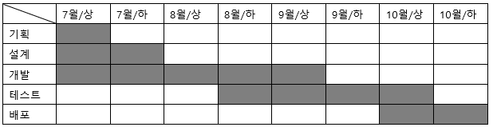

# 프로젝트 명 
> 우리의 프로젝트

# 프로젝트 목적

매주 진행하는 발표를 서로 익명성 투표를 하여 투표결과를 바탕으로 발표의 질을 높이고 철저한 벌칙과 재미를 위한 프로젝트입니다.

# 프로젝트 목표

취업을 위한 포트폴리오 겸 토이프로젝트 이므로 회사에서 요구하는 기술을 녹여볼려합니다.
## 자격요건

1. __Node.Js__ ,TypeScript ,NestJs
2. MySql( AWS Aurora ),MongoDB
3. Jest                         
4. Docker,Docker-compose
5. AWS (ECS, SNS, SQS, API Gateway 등)
6. Terraform

## 기업에서 우대하는 사항

- AWS, GCP, Azure와같은클라우드서비스사용경험
- Typescript 백엔드경력
- DDD (Domain Driven Design)에경험이있거나, 관심이있는분
- 마이크로서비스 아키텍처에 관심이 있거나 운영 경험이 있는 분
- NestJS 혹은 Spring 사용경험

위 자격사항과 우대사항을 충족하게 프로젝트를 진행 할 것입니다.

# 프로젝트 설계

## 요구사항
1. 카카오 및 Oauth 로그인 기능을 사용하여 사용자를 식별하기
2. 팀을 만들어서 관리자 및 팀 구성원이 사용자를 추가,삭제,변경
3. 발표에 사용했던 PPT,PDF,HWP 등 파일 자료 업로드
4. 익명 투표 기능
5. 발표 내역들을 저장하고 통계를 내어 보여주기.
6. 통계 자료를 엑셀 등 파일로 내보내기
7. sns에 공유하기 기능
8. 리액트를 이용하여 프론트엔드 구현
9. 데이터베이스 설계
## 일정 계획

### 상세 일정 _(예정)_
1. 기획
    - ~ 7월 10일 : 기획 마무리
2. 설계
    - ~ 7월 15일 : 설계 완료
3. 개발
    - ~ 7월 3일 : 요구사항 - 1, SNS, GOOGLE 등 외부 사이트 로그인 구현
      - ~~Kakao oAuth 로그인 구현~~
      - 존재하는 유저가 다른 oAuth를 이용하여 로그인할경우 이메일을 이용하거나 
    - ~ 7월 8일 : 로그인 구현과 같이 유저 정보 저장 
      - ~~카카오 로그인 유저 정보 저장.~~
      - 사이트에 직접으로 계정생성한 사람에 한함.( 암호화 )
    - ~ 7월 13일 : 요구사항 - 2, 구성원들 CRUD와 자료 테이블 관계 완성
    - ~ 7월 13일 : 요구사항 - 3, 자료 업로드 기능 구현
    - ~ 7월 15일 : 요구사항 - 4, 익명 투표기능 추가
    - ~ 7월 20일 : 요구사항 - 5, 통계 내역 그래프를 이용 하여 보여주기
    - ~ 7월 23일 : 요구사항 - 6, 요구사항 - 5의 그래프를 산출물로 내보내기 기능 구현
    - ~ 7월 30일 : 요구사항 - 7, SNS에 공유하여 보여주기 기능 구현
    - ~ 8월 20일 : 요구사항 - 8, 프론트 엔드 개발 시작
    - ~ 8월 25일 : 리팩토링 완료하기.
4. 테스트
5. 배포
# 기능 구현
## 카카오톡 로그인
> [카카오 Dev Doc 참조](https://developers.kakao.com/docs/latest/ko/kakaologin/common)

소개 : 

    카카오 로그인은 카카오계정과 애플리케이션(이하 앱)을 연결하고 토큰을 발급받아카카오 API를 사용할 수 있도록 하는 기능입니다. 
    토큰은 사용자를 인증하고 카카오 API 호출 권한을 부여하는 액세스 토큰(Access Token)와 액세스 토큰을 갱신하는 데 쓰는 리프레시 토큰(Refresh Token)이 있습니다

|NAME|설명|Kakao API|
|---|---|---|
|로그인|카카오계정 정보로 사용자를 인증하고 API 호출 권한을 얻습니다.|O|
|연결|카카오계정과 앱을 연결, 사용자가 해당 앱에서 카카오 API를 사용할 수 있게 합니다.|O|
|가입|카카오계정 정보로 로그인한 사용자를 서비스 데이터베이스(DB)에 회원으로 등록합니다.|X 서비스 자체 구현|
|로그아웃|로그아웃 요청한 사용자의 토큰을 만료시킵니다.|O|
|연결 끊기|카카오계정과 서비스 사이의 연결을 해제합니다.|O|
|탈퇴|회원 정보를 삭제하고 서비스를 더 이상 이용하지 않습니다.|X 서비스 자체 구현|
|토큰|API 호출 권한을 증명하며, 로그인을 통해 발급받습니다.|O|

### 로그인 과정

|토큰 종류|권한|유효기간|
|----|-----|-----|
|AccessToken|사용자를 인증|REST API : 6 시간|
|RefreshToken|일정 기간 동안 다시 인증 절차를 거치지 않고도 액세스 토큰 발급을 받을수 있게 해줍니다.|2달 유효기간 1달 남은 시점부터 갱신 가능|

## 로그인 과정
Node.js 의 미들웨어인 passport, passport-kakao를 이용하였습니다.

[카카오톡 로그인 과정](./controller/auth.js)

순서
1. router 및 app에 .use(passport.initialize())와 passport.session()을 연결
2. passport.use에서 clientId(카카오톡에서 발급받은 키),callbackURL:[로그인 성공후 콜백받을 URL]하여 로그인 시도 --> 성공하였으면 접속 토큰을 발급받고 사용자 정보를 가져온다.
3. passport.serializeUser를 이용하여 세션에 저장을 하고 저장이 완료된다면 로그인 과정 성공.

### passport
- serializeUser
   - verify callback으로 유저 정보를 전달하면 실행되는 함수로, 성공한 유저의 정보를 session에 추가한다.
- deserializeUser
   - deserializeUser은 Cookie에 저장된 passport session 정보를 이용해서 user정보를 가져오는 함수
   
passport를 이용하여 로그인에 성공을한다면 passport.session()을 이용하여 세션에 저장이된다.

##plu 몽고 DB 설명

[mongodb.md](./mdFiles/nosql.md)

# 후술...